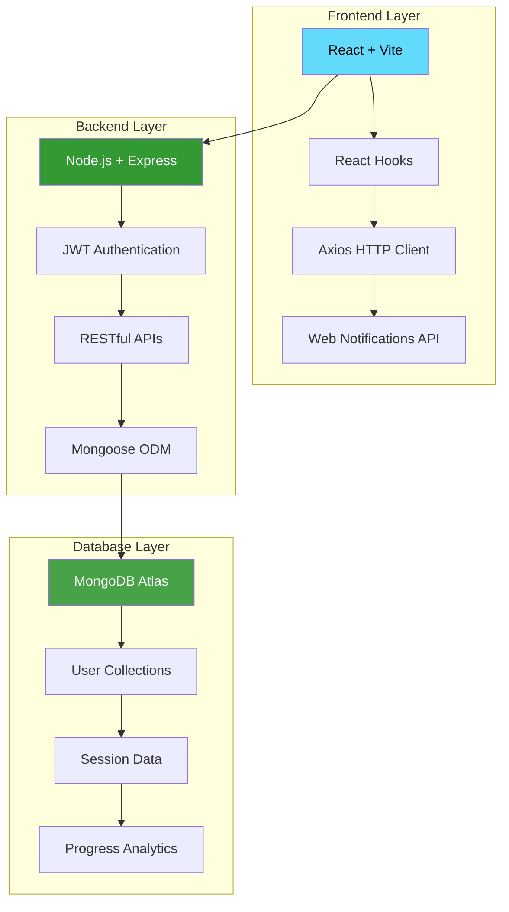
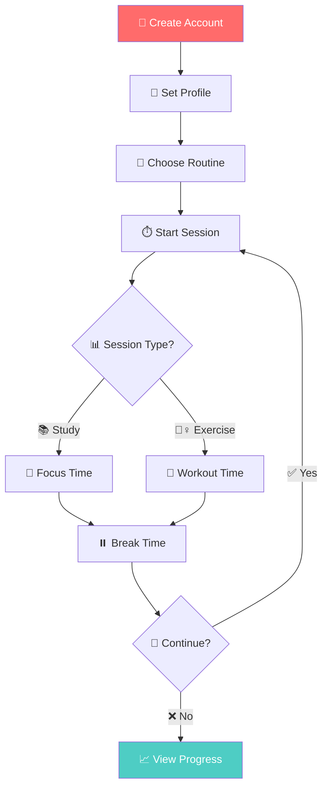

# 🏃‍♂️ Wellness Tracker

<div align="center">


**Balance Your Mind & Body - Smart Study & Exercise Companion** 💪🧠

[](https://reactjs.org)
[](https://nodejs.org)
[](https://mongodb.com)
[](https://expressjs.com)
[](https://jwt.io)
[](LICENSE)

---

*Transform your productivity with intelligent time management, fitness tracking, and wellness analytics* ✨

[🚀 Quick Start](#-getting-started) • [✨ Features](#-features) • [📱 Screenshots](#-screenshots) • [🛠️ Tech Stack](#-tech-stack) • [🤝 Contributing](#-contributing)

</div>

---

## 🌟 About the Project

<div align="center">

### 🎯 **Mission Statement**
*Empowering individuals to achieve the perfect balance between mental focus and physical wellness through intelligent session management and progress tracking.*

</div>

The **Wellness Tracker** is a comprehensive web application designed to revolutionize how you approach productivity and health. By seamlessly integrating study sessions with exercise routines, this platform helps you maintain optimal performance while building sustainable wellness habits.

### 🎪 **What Makes It Special**

<table>
<tr>
<td width="50%">

#### 🧠 **Mental Wellness**
- ⏰ Pomodoro-style study sessions
- 🎯 Focus time optimization
- 📊 Productivity analytics
- 🔔 Smart break reminders

</td>
<td width="50%">

#### 💪 **Physical Wellness**
- 🏋️‍♀️ Customizable workout routines
- ❤️ Cardio & strength training
- 🔥 Calorie burn tracking
- 📈 BMI monitoring

</td>
</tr>
</table>

---

## ✨ Features

<div align="center">

### 🏆 **Core Features**

</div>

| 🎯 Feature | 📋 Description | 🌟 Benefit |
|-----------|----------------|------------|
| ⏱️ **Smart Timer System** | Customizable session durations with auto-progression | Maintain optimal focus intervals |
| 📱 **Responsive Design** | Pixel-perfect UI across all devices | Seamless experience anywhere |
| 🏃‍♀️ **Exercise Library** | Cardio & Strength workout combinations | Comprehensive fitness coverage |
| 🔔 **Browser Notifications** | Real-time alerts for session transitions | Never miss a break or workout |
| 📊 **Progress Analytics** | Track BMI, points, and calories burned | Data-driven wellness insights |
| 🔄 **Auto-Resume** | Continue sessions after browser refresh | Uninterrupted workflow |
| 🍔 **Floating Navigation** | Mobile-optimized hamburger menu | Intuitive mobile experience |
| 💾 **Session Persistence** | Save and restore session state | Reliability and continuity |

### 🎨 **Advanced Features**

<details>
<summary>🔥 <strong>Click to explore advanced capabilities</strong></summary>

#### 🚀 **Performance Features**
- **⚡ Lightning Fast**: Optimized React components with Vite bundling
- **🔄 Real-time Sync**: Instant state updates across all components
- **💾 Smart Caching**: Efficient data persistence and retrieval
- **📱 PWA Ready**: Progressive Web App capabilities

#### 🛡️ **Security Features**
- **🔐 JWT Authentication**: Secure token-based authentication
- **🛡️ Protected Routes**: Role-based access control
- **🔒 Data Encryption**: Secure user data handling
- **🚫 XSS Protection**: Cross-site scripting prevention

#### 🎯 **User Experience**
- **🌙 Dark/Light Mode**: Customizable theme preferences
- **🎵 Sound Notifications**: Audio cues for session changes
- **📊 Visual Progress**: Interactive charts and graphs
- **⌨️ Keyboard Shortcuts**: Power user accessibility

</details>

---

## 🛠️ Tech Stack

<div align="center">

### 🏗️ **Architecture Overview**



</div>

### 🎨 **Frontend Technologies**

| Technology | Version | Purpose | Benefits |
|------------|---------|---------|----------|
|  | `18.2.x` | UI Framework | Component-based architecture |
|  | `4.x` | Build Tool | Lightning-fast development |
|  | `1.x` | HTTP Client | Promise-based requests |
|  | Built-in | State Management | Modern React patterns |

### ⚙️ **Backend Technologies**

| Technology | Version | Purpose | Benefits |
|------------|---------|---------|----------|
|  | `16.x+` | Runtime Environment | JavaScript everywhere |
|  | `4.x` | Web Framework | Minimal and flexible |
|  | `6.x` | Database | Document-based storage |
|  | `9.x` | Authentication | Stateless security |

---

## 🚀 Getting Started

### 📋 Prerequisites

<div align="center">

| Requirement | Version | Download Link |
|-------------|---------|---------------|
|  | `16.x+` | [Download Node.js](https://nodejs.org) |
|  | `8.x+` | Included with Node.js |
|  | `6.x+` | [MongoDB Atlas](https://mongodb.com/atlas) |
|  | Latest | [Download Git](https://git-scm.com) |

</div>

### 🎯 **Quick Installation**

```bash
# 📥 Clone the repository
git clone https://github.com/khaliduzzamantanoy/wellness-tracker.git

# 📂 Navigate to project directory
cd wellness-tracker

# 📦 Install dependencies for both frontend and backend
npm run install-all

# ⚙️ Set up environment variables
cp .env.example .env

# 🚀 Start the development servers
npm run dev
```

### 🔧 **Detailed Setup**

<details>
<summary>📝 <strong>Step-by-step installation guide</strong></summary>

#### 1️⃣ **Clone and Setup**

```bash
# Clone the repository
git clone https://github.com/khaliduzzamantanoy/wellness-tracker.git
cd wellness-tracker

# Install backend dependencies
cd backend
npm install

# Install frontend dependencies
cd ../frontend
npm install
```

#### 2️⃣ **Environment Configuration**

Create `.env` file in the backend directory:

```env
# Database Configuration
MONGODB_URI=mongodb+srv://your-connection-string
DB_NAME=wellness_tracker

# JWT Configuration
JWT_SECRET=your-super-secret-jwt-key
JWT_EXPIRES_IN=7d

# Server Configuration
PORT=5000
NODE_ENV=development

# Frontend URL (for CORS)
FRONTEND_URL=http://localhost:3000
```

#### 3️⃣ **Database Setup**

```bash
# Start MongoDB (if running locally)
mongod

# Or use MongoDB Atlas (recommended)
# 1. Create account at https://mongodb.com/atlas
# 2. Create cluster
# 3. Get connection string
# 4. Add to MONGODB_URI in .env
```

#### 4️⃣ **Start Development Servers**

```bash
# Terminal 1: Start backend server
cd backend
npm run dev

# Terminal 2: Start frontend server
cd frontend
npm run dev
```

</details>

### 🌐 **Access the Application**

| Service | URL | Description |
|---------|-----|-------------|
| 🎨 **Frontend** | `http://localhost:3000` | React development server |
| ⚙️ **Backend API** | `http://localhost:5000` | Express server |
| 📊 **API Docs** | `http://localhost:5000/api-docs` | Swagger documentation |

---

## 📱 Screenshots

<div align="center">

### 🖥️ **Desktop Experience**

<table>
<tr>
<td align="center">

<br><strong>📊 Dashboard Overview</strong>
</td>
<td align="center">

<br><strong>⏱️ Active Timer Session</strong>
</td>
</tr>
<tr>
<td align="center">

<br><strong>🏋️‍♀️ Exercise Routines</strong>
</td>
<td align="center">

<br><strong>📈 Progress Analytics</strong>
</td>
</tr>
</table>

### 📱 **Mobile Experience**

<table>
<tr>
<td align="center">

<br><strong>📱 Mobile Timer</strong>
</td>
<td align="center">

<br><strong>🍔 Hamburger Menu</strong>
</td>
<td align="center">

<br><strong>📊 Mobile Stats</strong>
</td>
</tr>
</table>

</div>

---

## 🎯 Usage Guide

### 🚀 **Getting Started Journey**

<div align="center">



</div>

### 📚 **Feature Deep Dive**

<details>
<summary>⏱️ <strong>Timer Management</strong></summary>

#### Setting Up Your Perfect Routine

1. **📝 Create Session**: Define study/exercise duration
2. **🎯 Set Goals**: Choose session count and break intervals  
3. **⏰ Start Timer**: Begin your focused work session
4. **🔔 Get Notified**: Receive alerts for transitions
5. **📊 Track Progress**: Monitor completion and stats

#### Timer Controls
- ▶️ **Play/Pause**: Control session flow
- ⏹️ **Stop**: End session early
- ⏭️ **Skip**: Move to next phase
- 🔄 **Reset**: Start over

</details>

<details>
<summary>🏋️‍♀️ <strong>Exercise System</strong></summary>

#### Available Workout Types

**💓 Cardio Exercises**
- 🏃‍♀️ Running in place
- 🕺 Jumping jacks  
- 🦵 High knees
- 👐 Burpees

**💪 Strength Training**
- 🤲 Push-ups
- 🧘‍♀️ Planks
- 🦵 Squats
- 🏋️‍♀️ Lunges

#### Exercise Features
- 🔥 Calorie calculation
- ⏱️ Duration tracking
- 📈 Progress monitoring
- 🎯 Custom combinations

</details>

---

## 🔧 API Reference

### 🛡️ **Authentication Endpoints**

| Method | Endpoint | Description | Auth Required |
|--------|----------|-------------|---------------|
| `POST` | `/api/auth/register` | Create new user account | ❌ |
| `POST` | `/api/auth/login` | User authentication | ❌ |
| `POST` | `/api/auth/logout` | Logout user | ✅ |
| `GET` | `/api/auth/profile` | Get user profile | ✅ |

### 📊 **Session Management**

| Method | Endpoint | Description | Auth Required |
|--------|----------|-------------|---------------|
| `POST` | `/api/sessions/create` | Start new session | ✅ |
| `PUT` | `/api/sessions/:id/update` | Update session progress | ✅ |
| `GET` | `/api/sessions/history` | Get session history | ✅ |
| `DELETE` | `/api/sessions/:id` | Delete session | ✅ |

### 📈 **Analytics & Stats**

| Method | Endpoint | Description | Auth Required |
|--------|----------|-------------|---------------|
| `GET` | `/api/stats/dashboard` | Get user statistics | ✅ |
| `PUT` | `/api/stats/bmi` | Update BMI data | ✅ |
| `GET` | `/api/stats/progress` | Get progress analytics | ✅ |

---

## 🚀 Deployment

### 🌐 **Production Deployment**

<details>
<summary>☁️ <strong>Deploy to Heroku</strong></summary>

#### Prerequisites
- Heroku CLI installed
- Git repository
- MongoDB Atlas account

#### Steps

```bash
# 1. Login to Heroku
heroku login

# 2. Create Heroku app
heroku create wellness-tracker-app

# 3. Set environment variables
heroku config:set MONGODB_URI=your-mongodb-connection-string
heroku config:set JWT_SECRET=your-jwt-secret
heroku config:set NODE_ENV=production

# 4. Deploy application
git push heroku main

# 5. Open application
heroku open
```

</details>

<details>
<summary>🐳 <strong>Docker Deployment</strong></summary>

#### Docker Configuration

```dockerfile
# Dockerfile
FROM node:16-alpine

WORKDIR /app

# Copy package files
COPY package*.json ./
RUN npm ci --only=production

# Copy application code
COPY . .

# Build frontend
RUN npm run build

EXPOSE 5000

CMD ["npm", "start"]
```

#### Docker Compose

```yaml
version: '3.8'
services:
  app:
    build: .
    ports:
      - "5000:5000"
    environment:
      - MONGODB_URI=mongodb://mongo:27017/wellness
      - JWT_SECRET=your-secret
    depends_on:
      - mongo
  
  mongo:
    image: mongo:6
    ports:
      - "27017:27017"
    volumes:
      - mongo_data:/data/db

volumes:
  mongo_data:
```

</details>

### 🔧 **Environment Variables**

| Variable | Description | Required | Default |
|----------|-------------|----------|---------|
| `MONGODB_URI` | MongoDB connection string | ✅ | - |
| `JWT_SECRET` | JWT signing secret | ✅ | - |
| `PORT` | Server port | ❌ | `5000` |
| `NODE_ENV` | Environment mode | ❌ | `development` |
| `FRONTEND_URL` | Frontend URL for CORS | ❌ | `http://localhost:3000` |

---

## 🧪 Testing

### 🔬 **Test Coverage**

<div align="center">


</div>

```bash
# 🧪 Run all tests
npm test

# 📊 Generate coverage report
npm run test:coverage

# 🔍 Run specific test suite
npm run test:unit
npm run test:integration
npm run test:e2e
```

### 🎯 **Testing Strategy**

| Test Type | Framework | Coverage |
|-----------|-----------|----------|
| 🧪 **Unit Tests** | Jest + React Testing Library | Components, Hooks, Utils |
| 🔗 **Integration Tests** | Supertest + Jest | API Endpoints |
| 🎭 **E2E Tests** | Cypress | User Workflows |
| 📊 **Performance Tests** | Lighthouse CI | Core Web Vitals |

---

## 🤝 Contributing

<div align="center">

**Join our amazing community of contributors!** 🌟

[](https://github.com/khaliduzzamantanoy/wellness-tracker/graphs/contributors)
[](https://github.com/khaliduzzamantanoy/wellness-tracker/pulls)
[](https://github.com/khaliduzzamantanoy/wellness-tracker/issues)

</div>

### 🔄 **How to Contribute**

```bash
# 1. 🍴 Fork the repository
# 2. 📥 Clone your fork
git clone https://github.com/YOUR_USERNAME/wellness-tracker.git

# 3. 🌿 Create feature branch
git checkout -b feature/amazing-feature

# 4. ✨ Make your changes
# 5. 🧪 Run tests
npm test

# 6. 💾 Commit changes
git commit -m '✨ Add amazing feature'

# 7. 🚀 Push to branch  
git push origin feature/amazing-feature

# 8. 🎉 Create Pull Request
```

### 📋 **Contribution Guidelines**

<details>
<summary>📝 <strong>Development Standards</strong></summary>

#### Code Style
- 🎨 Use Prettier for formatting
- 📏 Follow ESLint rules
- 📝 Write meaningful commit messages
- 🧪 Add tests for new features

#### Pull Request Process
1. 📖 Update documentation
2. 🧪 Ensure tests pass
3. 🔍 Get code review approval
4. 🎯 Squash commits before merge

#### Issue Templates
- 🐛 Bug reports
- ✨ Feature requests  
- 📚 Documentation improvements
- ❓ Questions and support

</details>

### 🏆 **Recognition**

<div align="center">

**Hall of Fame** 🌟

Thanks to all our amazing contributors who make this project possible!

<a href="https://github.com/khaliduzzamantanoy/wellness-tracker/graphs/contributors">
  
</a>

</div>

---

## 📊 Project Statistics

<div align="center">


### 📈 **Development Activity**


</div>

---

## 🚀 Roadmap

### 📅 **Upcoming Features**

| 🎯 Feature | 📅 Timeline | 🏷️ Priority | 📋 Status |
|-----------|-------------|-------------|-----------|
| 🌙 Dark Mode Theme | Q2 2024 | High | 🔄 In Progress |
| 📱 Mobile App (React Native) | Q3 2024 | High | 📋 Planned |
| 🤝 Social Features & Groups | Q3 2024 | Medium | 📋 Planned |
| 🧠 AI-Powered Recommendations | Q4 2024 | Medium | 💡 Research |
| 🎵 Spotify Integration | Q4 2024 | Low | 💡 Research |
| 🏆 Achievement System | Q1 2025 | Medium | 📋 Planned |

### 🎯 **Long-term Vision**
- 🌍 Multi-language support
- 📊 Advanced analytics dashboard
- 🤖 Machine learning insights
- 🎮 Gamification elements
- 👥 Team collaboration features

---

## 📄 License

<div align="center">

This project is licensed under the **MIT License** 📜

[](https://opensource.org/licenses/MIT)

*Feel free to use, modify, and distribute this project* ✨

[📖 Read the full license](LICENSE)

</div>

---

## 💬 Support & Community

<div align="center">

### 🆘 **Get Help**

| 📞 Support Channel | 🔗 Link | 📝 Description |
|------------------|---------|----------------|
| 🐛 **Bug Reports** | [Issues](https://github.com/khaliduzzamantanoy/wellness-tracker/issues) | Report bugs and technical issues |
| 💡 **Feature Requests** | [Discussions](https://github.com/khaliduzzamantanoy/wellness-tracker/discussions) | Suggest new features |
| 📚 **Documentation** | [Wiki](https://github.com/khaliduzzamantanoy/wellness-tracker/wiki) | Comprehensive guides |
| 💬 **Community Chat** | [Discord](https://discord.gg/wellness-tracker) | Real-time community support |

### 🌟 **Show Your Support**

**If this project helped you, please consider giving it a ⭐!**

[](https://github.com/khaliduzzamantanoy/wellness-tracker/stargazers)
[](https://github.com/khaliduzzamantanoy/wellness-tracker/network)
[](https://github.com/khaliduzzamantanoy/wellness-tracker/watchers)

</div>

---

<div align="center">

**Made with ❤️ by [Khaliduzzaman Tanoy](https://github.com/khaliduzzamantanoy)**

*Wellness Tracker - Where productivity meets wellness* 🚀


**⚡ Fuel your productivity, energize your wellness journey!** 

</div>
